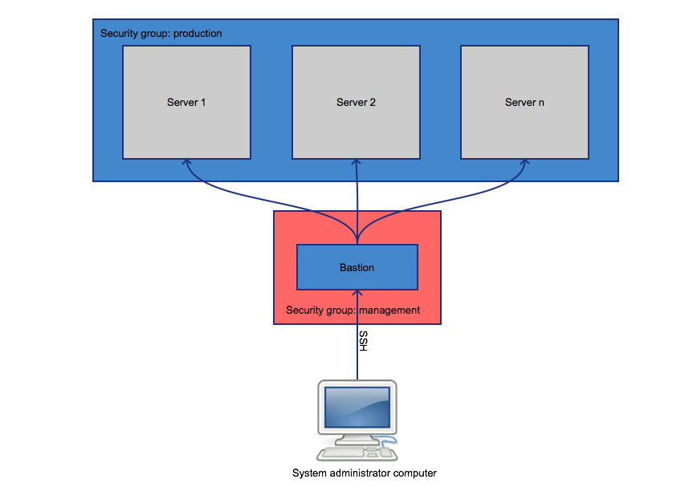
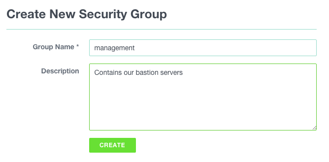
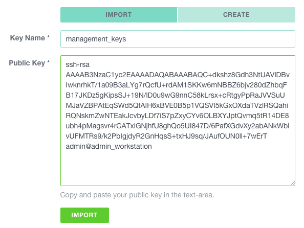
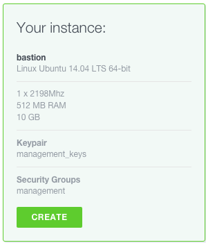

#Creating a bastion

A good practice to protect access to your production systems is to create a (bastion)[https://en.wikipedia.org/wiki/Bastion_host]. Such a server is the only one from which it is possible to connect to other systems, all connections to administration interfaces have to be proxied through it. Specific attention should be paid into its security and its monitoring.
This document describes how to create such a server and deploy essential security measures to protect it.

This schema illustrates what we are going to achieve:

 

##Instance creation

###Security group

First thing first, let's create a security group for our bastion. Naviguate to COMPUTE > FIREWALLING and click on the `ADD` button. Give it a name and click `CREATE`.

###SSH key pair

If this is not already done, generate keys on the computer you will use to connect to the bastion.

    $ ssh-keygen

ssh-keygen has numerous options to enhance security of the generated keys, please read the (documentation)[http://www.openbsd.org/cgi-bin/man.cgi/OpenBSD-current/man1/ssh-keygen.1?query=ssh-keygen&sec=1].

Copy the content of the (just created) `~/.ssh/id_rsa.pub` file. Naviguate to COMPUTE > SSH KEYS and click on the `ADD` button. Be sure that `IMPORT` is selected, name the key, paste the content of the `~/.ssh/id_rsa.pub` file and click `IMPORT`.

###Instance

Now we are going to create an instance in this newly created security group, using the management key-pair. Naviguate to COMPUTE > INSTANCES and click on the `ADD` button.

Use the following specifications to create the bastion. Unless you plan to use ressources heavy mangement tools to administrate your server, a micro instance should suffice.

#Admin user creation

sudo

#Firewall

create the rules (GUI et cli)

#SSH

fail2ban
no root
only key acces
2FA
    - Google Auth
    - Yubikey

