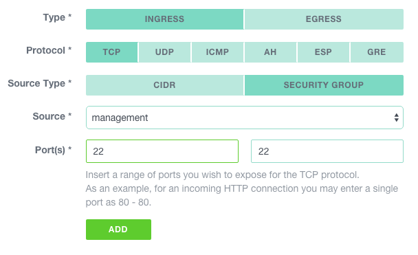

#Creating a bastion

A good practice to protect access to your production systems is to create a [bastion](https://en.wikipedia.org/wiki/Bastion_host). Specific attention should be paid into its security and its monitoring.
This document describes how to create such a server and deploy essential security measures to protect it.

This schema illustrates what we are going to achieve:

 

All connections to the administration interfaces of your production instances have to be proxied through the bastion. 

##Instance creation

###Security group

First thing first, let's create a security group for our bastion. Naviguate to `COMPUTE > FIREWALLING` and click on the `ADD` button. Give it a name and click `CREATE`.


As we have not yet defined any rule, all instances belonging to it using it will be impossible to connect to.

Let's add a rule to allow ssh from our admin workstation. In the `COMPUTE > FIREWALLING` section click on the newly created group. 
Then, click on the `NEW RULE` button and create a rule using the public ip address of your admin workstation as source and tcp/22 as the authorized port.


Click on `ADD` to complete our management security group setup.

###SSH key pair

If this is not already done, [generate keys](https://community.exoscale.ch/documentation/compute/ssh-keypairs/) on the computer you will use to connect to the bastion.

    $ ssh-keygen -t rsa -b 4096 -C 'bastion'

ssh-keygen has numerous options to enhance security of the generated keys, please read the (documentation)[http://www.openbsd.org/cgi-bin/man.cgi/OpenBSD-current/man1/ssh-keygen.1?query=ssh-keygen&sec=1].


Copy the content of the (just created) `~/.ssh/id_rsa_bastion.pub` file. Naviguate to `COMPUTE > SSH KEYS` and click on the `ADD` button. Be sure that `IMPORT` is selected, name the key, paste the content of the `~/.ssh/id_rsa_bastion.pub` file and click `IMPORT`.

Important: Keep this private key and its passphrase (if you've used one) in a safe place.


###Instance

Now let's create an instance in this newly created security group, using the management key-pair. Naviguate to `COMPUTE > INSTANCES` and click on the `ADD` button.

Use the following specifications to create the bastion. Unless you plan to use ressources heavy mangement tools to administrate your server, a micro instance should suffice.


Let's test our instance by connection to it; select it in the instance list and copy the `SSH command` in your shell on your admin workstation.

You should be logged in on the bastion.

###Firewalling

From now on, each time you create an instance, make sure at least one security group as a rule authorizing connections from the bastion to the management port of this instance.

Example to create a rule authorizing ssh from the bastion:



Depending on the applications you will manage, you might want to add more ports.

##Essential security measures

###Automatic upgrades

You might want to allow for automatic upgrades, to be sure not to miss any security updates of openssh:

    $ dpkg-reconfigure -plow unattended-upgrades

###Fail2ban

Fail2ban automatically blacklists ip address from which any tentative of brute-force attack on your sshd process is detected.
Activate it with:

    $ apt-get update && apt-get -y  install fail2ban

The default settings should be suffisant in most cases.

###SSH Tunneling

    ?

###SSH Double authentication

####Google Auth
    
Install the pam google authenticator module with:
    
    $ apt-get -y install libpam-google-authenticator

Activate it by adding the following line to your /etc/pam.d/sshd file

    auth required pam_google_authenticator.so 
    $ echo "auth required pam_google_authenticator.so" >> /etc/pam.d/sshd 

Then add the following two lines to your /etc/ssh/sshd_config file to force the second factor in addition to your ssh key to logon the bastion:

    ```ChallengeResponseAuthentication yes
    AuthenticationMethods publickey,keyboard-interactive```

Don't forget to run `google-authenticator` once in all the accounts you want to protect.

####Yubikey

    ?

###Add users

    ?
    
Another good practices consist in adding different users for each admin and only allowing them to execute privileged process using sudo. 

