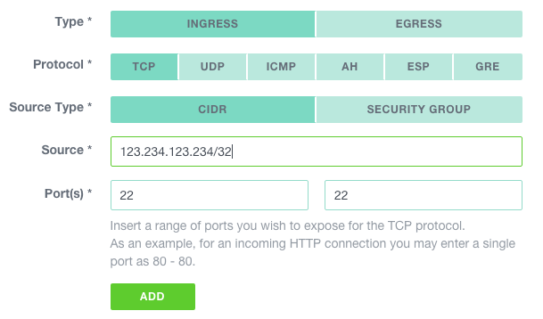

#Creating a bastion for your Cloud Computing setup

No matter how many servers you run in production or what flavor of Linux distribution you use, leaving administration ports
open on the Internet for your Web Application, SaaS, or Docker cluster is considered unsecure. A good practice to protect access to your production systems is to create a [bastion](https://en.wikipedia.org/wiki/Bastion_host). In a nutshell, a bastion is the only host from which you can manage all your services. Firewalls rules must be created, so that all the administration interfaces of your services are reachable only from this special host.

This document describes how to configure security groups, create such a server and deploy essential security measures to protect it, using Exoscale Cloud insfrastructure.

This diagram illustrates what we are going to achieve:

 

##Instance creation

###Security group

First thing first, let's create a security group for our bastion. Naviguate to `COMPUTE > FIREWALLING` and click on the `ADD` button. Give it a name and click `CREATE`.


As we have not yet defined any rule, all instances belonging to it will be impossible to connect to. By default all inbound traffic is filtered.

Let's add a rule to allow ssh from our admin workstation. In the `COMPUTE > FIREWALLING` section click on the newly created group. 
Then, click on the `NEW RULE` button and create a rule using the public ip address of your admin workstation as source and tcp/22 as the authorized port.



Click on `ADD` to complete our management security group setup.

For more information about security groups, please check the [documentation](https://community.exoscale.ch/documentation/compute/security-groups/).

###SSH key pair

If this is not already done, generate keys on the workstation you will use to connect to the bastion.

    $ ssh-keygen -t rsa -b 4096 -C 'bastion'

ssh-keygen has numerous options to enhance security of the generated keys, please read the (documentation)[http://www.openbsd.org/cgi-bin/man.cgi/OpenBSD-current/man1/ssh-keygen.1?query=ssh-keygen&sec=1].


Copy the content of the (just created) `~/.ssh/id_rsa_bastion.pub` file. 
Naviguate to `COMPUTE > SSH KEYS` and click on the `ADD` button. 
Be sure that `IMPORT` is selected, name the key, paste the content 
of the `~/.ssh/id_rsa_bastion.pub` file and click `IMPORT`.

Important: Keep this private key and its passphrase (I strongly encourage you to use one) in a safe place.


For more information about key pairs, please check the [documentation](https://community.exoscale.ch/documentation/compute/ssh-keypairs/).

###Instance

Now let's create an instance in this newly created security group, using the management key-pair. Naviguate to `COMPUTE > INSTANCES` and click on the `ADD` button.

Use the following specifications to create the bastion. Unless you plan to use ressource-heavy management tools to administrate your server, a micro instance should suffice.


Let's test our instance by connecting to it; select it in the instance list and copy the `SSH command` in your shell on your admin workstation.

You should be logged in on the bastion.

###Firewalling

From now on, each time you create an instance, make sure at least one security group has a rule authorizing connections from the bastion to the management port of this instance.

Example to create a rule authorizing ssh access from the bastion (in our example schema, this would be defined in the `production` security group):


Depending on the applications you will manage, you might want to add rules allowing different sets of ports.

##Essential security measures to deploy on the bastion itself.

###Automatic upgrades

You might want to allow for automatic upgrades, to be sure not to miss any security updates of 
openssh or other critical system software:

    $ dpkg-reconfigure -plow unattended-upgrades

###Fail2ban

Fail2ban automatically blacklists ip address from which any tentative of brute-force attack on your sshd process is detected.
Activate it with:

    $ apt-get update && apt-get -y install fail2ban

The default settings should be sufficient in most cases.

##(Optional) SSH strong authentication with google authenticator

Using [Two-factor authentication](https://en.wikipedia.org/wiki/Two-factor_authentication), it is possible to add extra security to the ssh server of your bastion. Each SSH connection will then require:

* your SSH Key
* your One Time Password

Let's do this with the google authenticator application and the appropriate ssh pam module.

Install the pam google authenticator module with:
    
    $ apt-get -y install libpam-google-authenticator

Activate it by adding the following line to your /etc/pam.d/sshd file

    $ echo "auth required pam_google_authenticator.so" >> /etc/pam.d/sshd 


Then add the following two lines to your /etc/ssh/sshd_config file to force the second factor in addition to your ssh key to logon the bastion:

    ```ChallengeResponseAuthentication yes
    AuthenticationMethods publickey,keyboard-interactive```

And restart the ssh service with

    $ service ssh restart

Run `google-authenticator` once in all the accounts you want to protect and follow the procedure.

##Seamless connection to machines

To administrate your remote services from your local machine, you might want to create a local port forwarding using ssh

    $ ssh -L [<LocalAddress>]:<LocalPort>:<RemoteHost>:<RemotePort> sshUser@remoteServer

This will allow a connection to a remote port as if the service was running locally.

For example, let's say you would like to connect to a remote postgresql instance which is accessible from your bastion only, you could type something like:

    $ ssh -L 5000:postgresql-server-ip:5432 root@bastion
    $ psql -p 5000 -h 127.0.0.1 -U postgres
    
This will mount an SSH tunnel from your workstation local port 5000 to the postgresql server database port.
    
##Going further

Maintaining a tight security on the bastion is not the only key to secure your production 
workload. You should also make sure that your workstation security and SSH client configuration is at
its best. Mozilla maintains a good guide on 
[SSH security guidelines](https://wiki.mozilla.org/Security/Guidelines/OpenSSH) where 
you can get best practices on using SSH Agent and forwarding accordingly.

Last but not least, additional open source tools that check your bastion integrity like
[OSSEC](http://ossec.github.io/) can be a nice addition to this setup and add intrusion 
dectection to your security measures.
